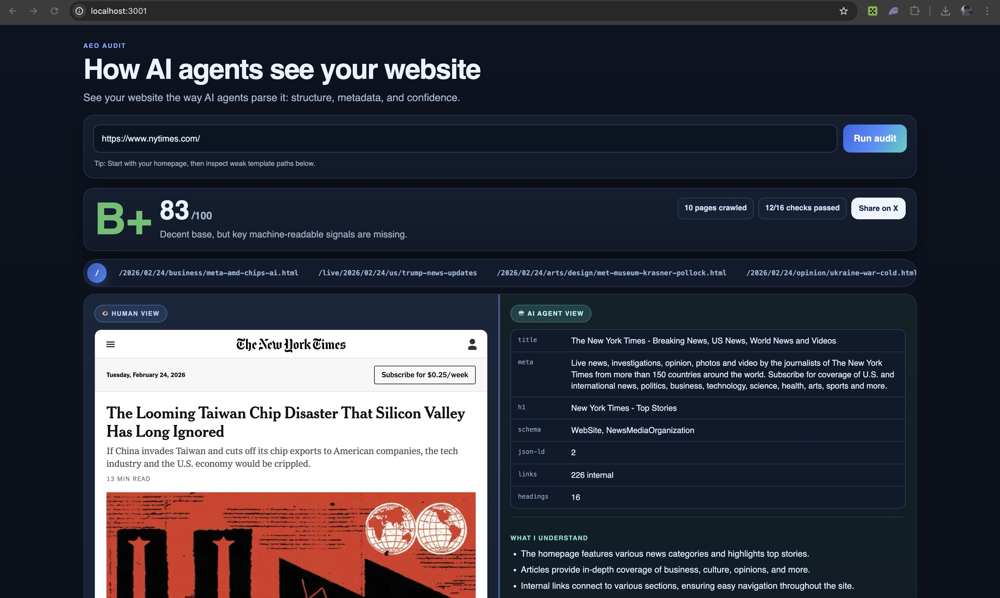

# Improve Website AEO/GEO Skill

[](https://aeo-audit.sh/)

The web is changing. Websites are no longer read only by humans — AI agents like ChatGPT, Claude, Perplexity, and Google AI Overviews are now the primary way millions of people discover and consume information. If your site isn't optimized for how AI reads, parses, and cites content, you're invisible to a growing share of your audience.

**Check your score at [aeo-audit.sh](https://aeo-audit.sh/)** — then use this skill to improve it.

## What it does

When invoked on a website codebase, this skill:

1. **Audits** your code for 16 foundational AEO checks (robots.txt, structured data, meta tags, content depth, etc.)
2. **Evaluates** 6 intelligence dimensions (answer readiness, quotability, evidence density, content depth, freshness, structural clarity)
3. **Makes concrete code changes** in priority order to improve your site's AEO score
4. **Provides framework-specific guidance** for Next.js, Astro, plain HTML, and more

## Install

```bash
claude skill add --from https://github.com/onvoyage-ai/improve-website-aeo-geo-skill
```

Or manually copy `skill.md` into your project's `.claude/skills/` directory.

## Usage

Once installed, invoke the skill in Claude Code:

```
/improve-website-aeo-geo
```

Or reference it contextually:

> "Use the AEO skill to optimize this site"

## Companion Tool

This skill works best alongside [AEO Audit](https://aeo-audit.sh/) — run an audit before and after to measure your score improvement.

## Scoring Methodology

Based on the AEO Check scoring model:

- **Foundational Score (50%)**: 16 deterministic checks worth 134 total points
- **Intelligence Score (50%)**: 6 LLM-evaluated dimensions (0-5 scale each)
- **Final Score**: 0-100, mapped to letter grades (A+ through F)

### Key Research Backing

| Optimization | Impact |
|---|---|
| Answer-first paragraphs | 4.8x more AI citations |
| Comparison tables | 2.8x more citations |
| FAQ blocks | +156% citation rate |
| In-text citations | +115% AI visibility |
| Statistics in content | +40% citation rate |
| Clean heading hierarchy | 3.2x more citations |
| Long-form content (2000+ words) | 3x more citations |
| Content updated in last 30 days | Cited by 76% of ChatGPT's top sources |

## License

MIT
